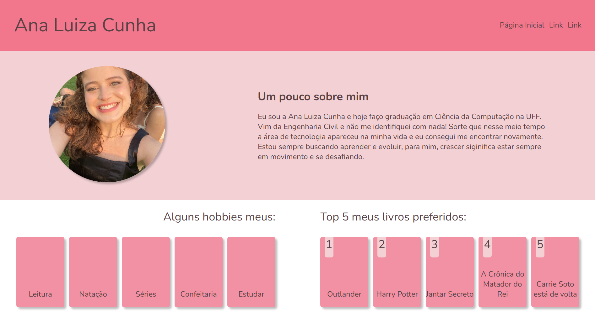
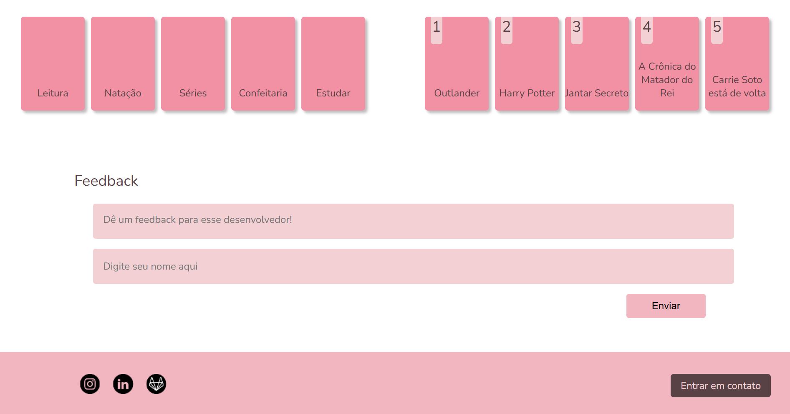
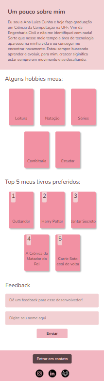

# Página Individual - Ana Luiza Cunha

Este projeto é uma página individual desenvolvida para o treinamento da Empresa Junior IN Junior. Tem como objetivo apresentar algumas informações pessoais.

## ✨ Funcionalidades

- **Apresentação pessoal** com foto e descrição.
- **Lista de hobbies** em cards estilizados.
- **Top 5 livros favoritos** em cards numerados.
- **Formulário de feedback** para visitantes enviarem mensagens.
- **Menu responsivo** com ícone de hambúrguer para navegação em dispositivos móveis.
- **Links para redes sociais** e botão de contato no rodapé.

## 🖼️ Demonstração

### Versão Desktop

### Versão Mobile

## 🛠️ Tecnologias utilizadas

- HTML
- CSS (com media queries para responsividade)
